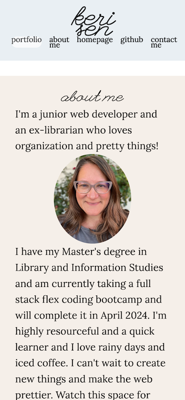
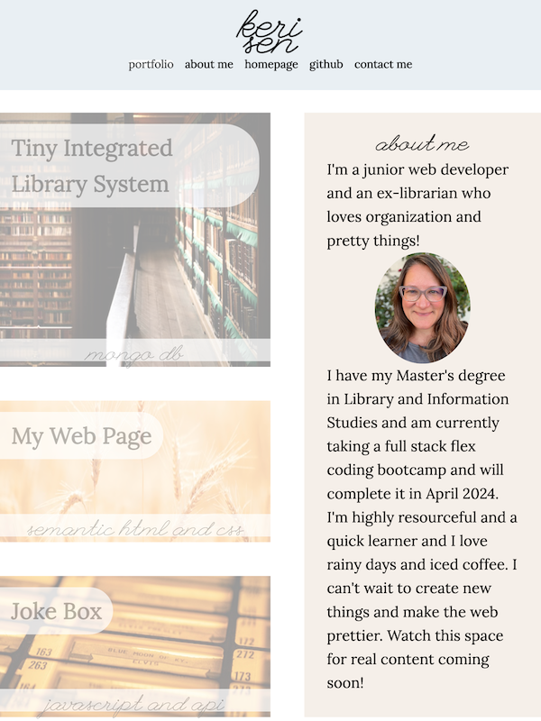
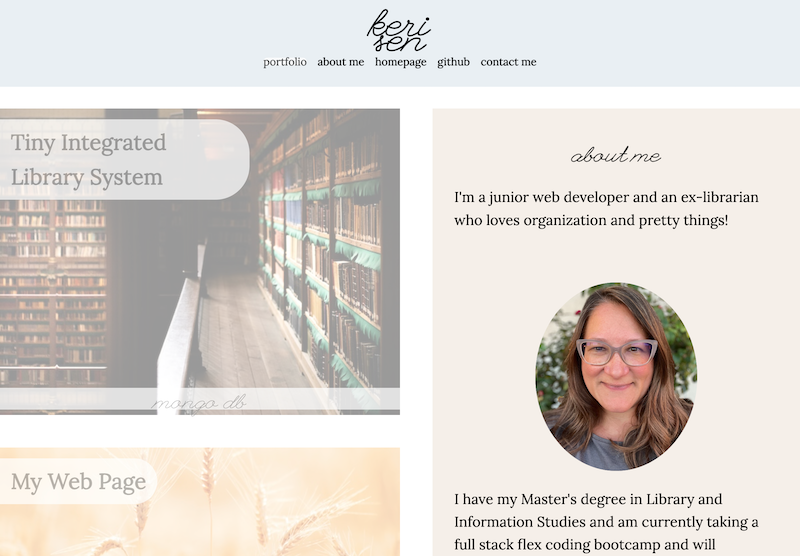
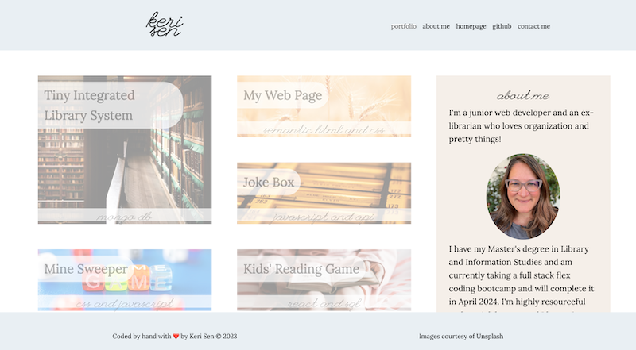

# Keri Sen's Portfolio

## Description

This is my "work in progress" web portfolio for my upcoming projects as I progress in my full stack flex coding bootcamp. It currently holds placeholder images from Unstack. There is one working project - "My Web Page" - that links to a simple web page that will hold my resume and expanded contact info as I continue in my course and career.

I designed it from a "mobile first" approach, but it still breaks around a screen size of 375 pixel width (the top nav bar is too wide). I will add a hamburger navigation button when I have learned more javascript.

## Installation

To check for responsiveness, use the "Inspect" command in Google Chrome Dev Tools and select devices from the Dimensions line at the top.

No installation is required to view the website.

## Usage

The website is deployed at: [https://kerilsen.github.io/portfolio/index.html] https://kerilsen.github.io/portfolio/index.html

Here are views of the portfolio from a few different devices.

## Credits

All app placeholder images are from [Unstack](https://www.unstack.com).
* Library aisles - Red Charlie
* Wheat field - Vadim Paripa
* Juke box - Pedro Forester da Silva
* Colorful dice - Audrey Metelev
* Child with book - Annie Spratt
* Shopping cart - Bruno Kelzer
* Wind up robot - Rock N Roll Monkey

Fonts are from [Google Fonts](https://fonts.google.com).
* League Script - Haley Fiege
* Lora - Cyreal

## License

Please refer to the LICENSE in the repo.

---